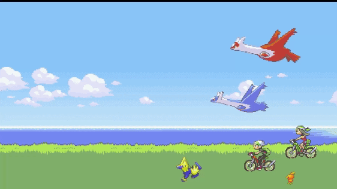

# Animated Wallpaper – Pokémon Emerald (HTML/CSS)

This is a wallpaper inspired by **Pokémon Emerald**, made using HTML and CSS, designed to be used with **Lively Wallpaper**.

## Language

- [English Version](README-ENGLISH.md)
- [Versão em Português](README.md)

## Preview

## How to Use

1. Download all project files (including `index.html`, `style.css`, images, etc.).
2. Open **Lively Wallpaper**.
3. Click the **"+"** button to add a new wallpaper.
4. Select the `index.html` file.
5. That’s it – your wallpaper is ready!

## Credits

All images used in this project were found online and belong to their respective authors. Full credit goes to them:

- **Background**: [Reddit - Pokémon Emerald Blank Wallpaper](https://www.reddit.com/r/PokemonEmerald/comments/5y1nwg/pokemon_emerald_wallpaper_blank/)
- **Latios and Latias**: [AlphaCoders Wallpaper](https://wall.alphacoders.com/big.php?i=950765)
- **Pokémon sprites**: [The Spriters Resource – Pokémon Emerald](https://www.spriters-resource.com/game_boy_advance/pokemonemerald/sheet/8364/)
- **Bike protagonists**: [Reddit - Rainmeter Pokémon](https://www.reddit.com/r/Rainmeter/comments/2gxp5j/oc_pokemon_ruby_sapphire_emerald_credits/)

> This project is for personal and educational purposes only. No content should be redistributed for commercial use.

## License

This is a non-commercial project. All image rights belong to their respective creators.
